# PhenoPixel

PhenoPixel is a FastAPI + React application for microscopy single-cell
extraction, annotation, visualization, and batch phenotype analysis. It is
designed around ND2 microscopy workflows: upload an ND2 file, extract cell
contours, clean labels, inspect individual cells, and export population-level
shape and fluorescence descriptors.

The montage below shows a label-1 cell population from `microscope_data.db`.
The overlay renders `fluo1` as magenta and `fluo2` as green without scale bars,
with display intensity balanced per cell while avoiding saturation.

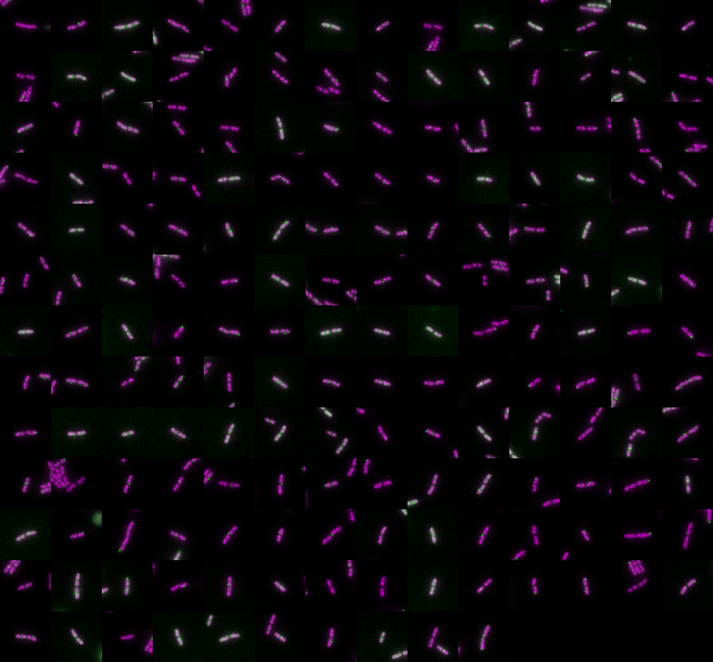

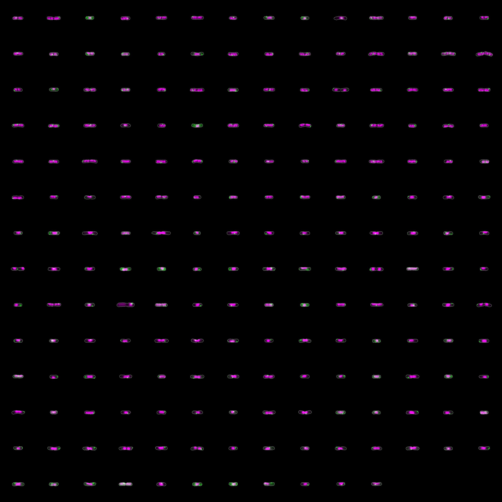

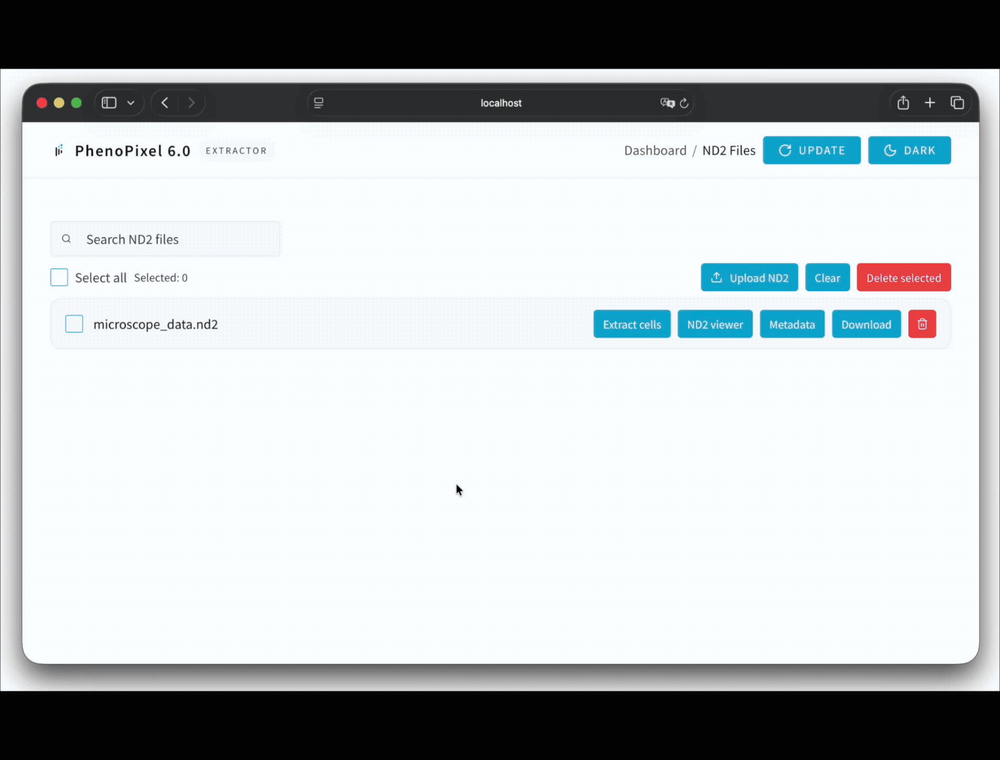

## Key Features

| Area | What PhenoPixel provides |
| --- | --- |
| ND2 management | Upload, list, inspect metadata, download, delete, and parse `.nd2` files. |
| Cell extraction | Generate cropped cell images, contours, preview frames, and SQLite databases. |
| Annotation | Review auto-detected cells and relabel single cells or debris in bulk. |
| Cell viewer | Inspect phase, fluorescence, overlays, replot views, heatmaps, map views, distributions, and raw images per cell. |
| Bulk analysis | Export and visualize cell length, area, fluorescence intensity summaries, heatmap vectors, contours, Map256 strips, raw intensities, and JSON/CSV data. |
| Research reporting | Keep database files, exports, screenshots, and method formulas close to the analysis code for reproducible reporting. |

## Requirements

| Component | Notes |
| --- | --- |
| Python | Local launch examples use `python3.14`; the Docker backend image uses Python 3.11. |
| Node.js / npm | Required for the React frontend, Docusaurus docs build, and Storybook screenshots. Dependency versions are locked in `frontend/package-lock.json`. |
| SQLite | Used for extracted cell databases through SQLAlchemy. |
| OpenCV system libraries | Local installs use `opencv-python`; Docker also installs `libgl1` and `libglib2.0-0`. |

## Quick Start

Run the backend and frontend from the repository root in separate terminals.
The local quick-start path uses `python3.14`; the Docker backend image uses
Python 3.11.

### Backend

```sh
python3.14 -m venv venv
source ./venv/bin/activate
cd backend
pip install -r requirements.txt
python main.py
```

### Frontend

```sh
cd frontend
npm install
npm run dev
```

If npm reports peer dependency conflicts around Vite and Storybook, use:

```sh
npm install --legacy-peer-deps
```

### Local URLs

| Service | URL |
| --- | --- |
| Backend | http://localhost:3000 |
| Frontend dev server | http://localhost:3001 |
| API base | http://localhost:3000/api/v1 |
| Swagger UI | http://localhost:3000/api/v1/docs |
| OpenAPI JSON | http://localhost:3000/api/v1/openapi.json |
| Health check | http://localhost:3000/api/v1/health |

## Input Data

| Item | Notes |
| --- | --- |
| Primary input | `.nd2` files. Upload through the UI or place them under `backend/app/nd2files/`. |
| Filename rules | Only `.nd2` is accepted; path components are stripped and dots in stems are normalized during processing. |
| Channel/layer modes | `single`, `dual`, `dual(reversed)`, `triple`, and `quad` are supported by the extraction UI/API. |
| Metadata | ND2 metadata can be viewed from the ND2 Manager. Channel count may be inferred when the metadata exposes it. |
| Time/Z data | The parser can expose ND2 frame metadata, but cell extraction expects the selected layer mode to match the frame/channel organization. Validate previews before running large jobs. |

## Workflow

### 1. ND2 Manager

Manage ND2 files: upload datasets, inspect metadata, delete old files, and open
a selected ND2 file in Cell Extraction.

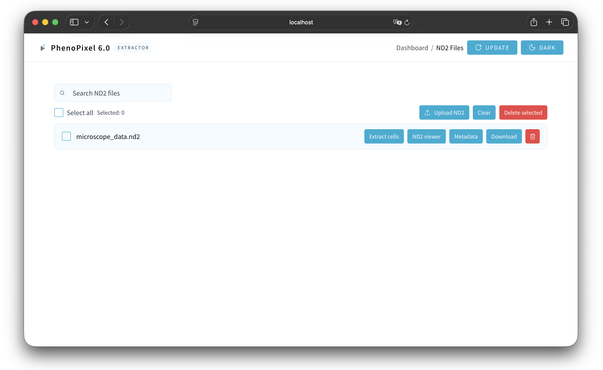

### 2. Cell Extraction

Choose the layer mode, objective scale, Canny threshold (`param1`), crop size,
and Auto Annotation setting, then start extraction. The backend creates contour
previews and one or more SQLite databases for downstream analysis.

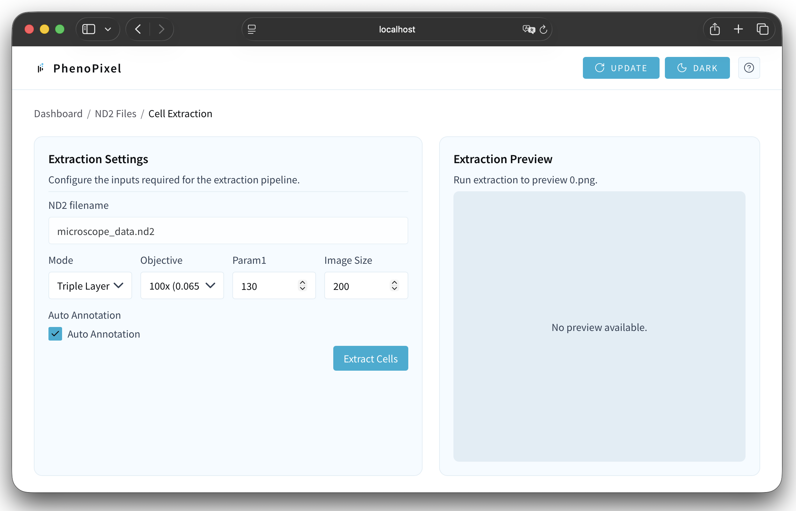

When extraction finishes, review the preview frames. If contours are poor,
adjust parameters and re-extract.

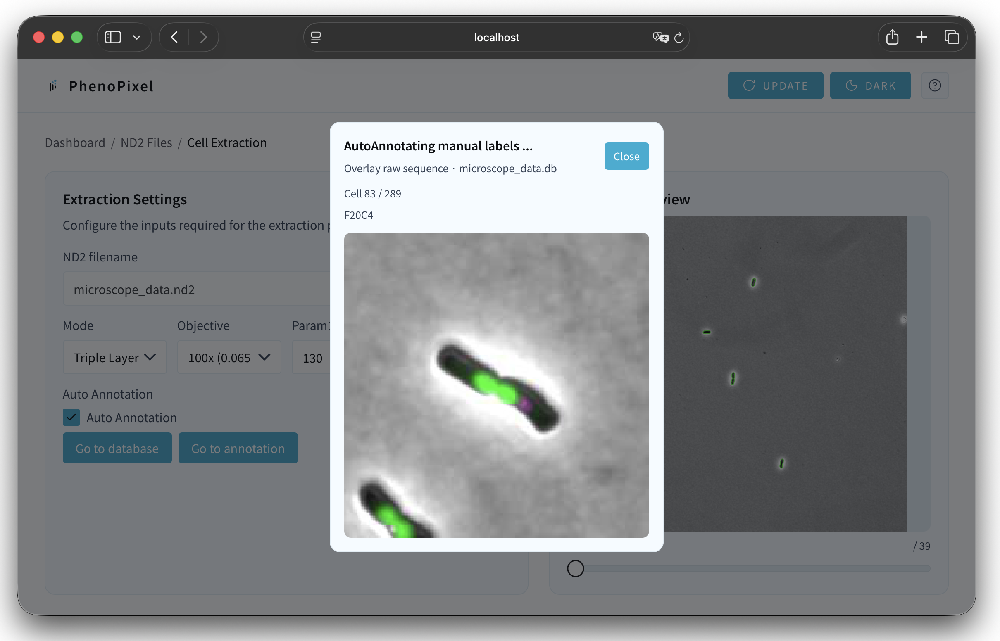

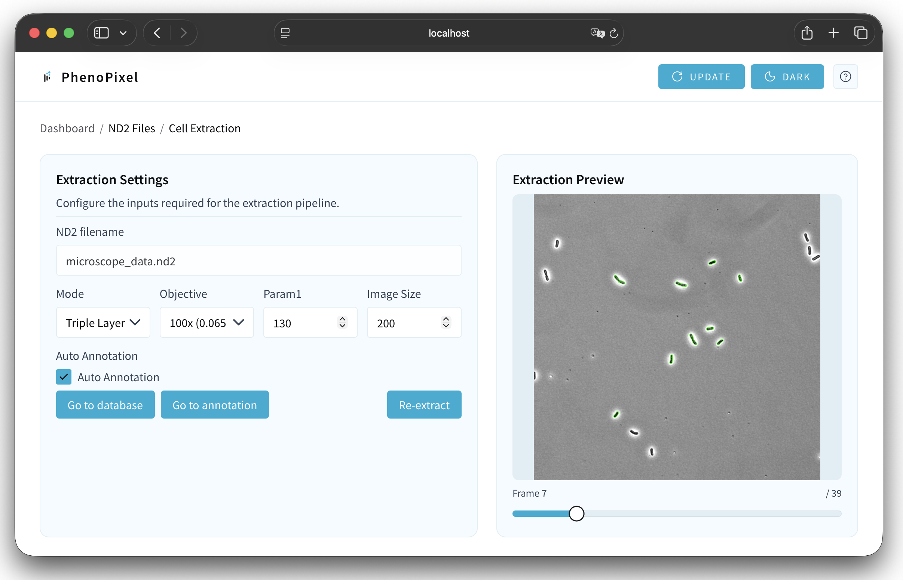

### 3. Database Manager

Cell databases generated by extraction can be uploaded, downloaded, renamed,
deleted, and opened for cell-level review.

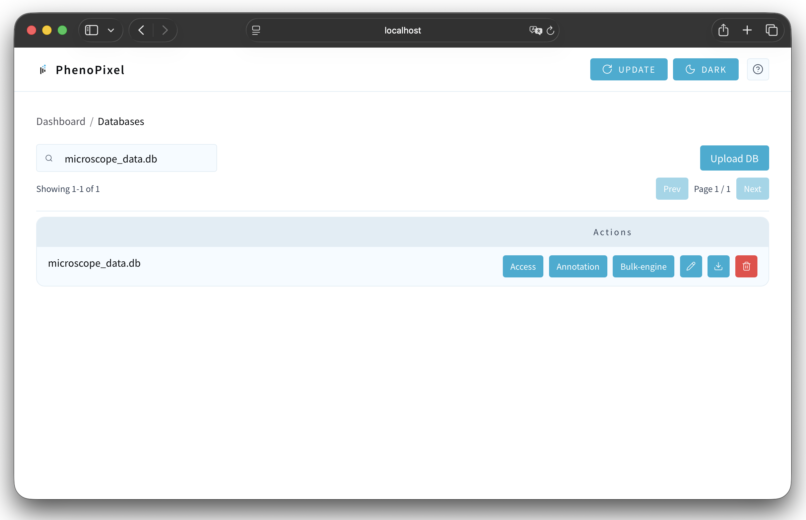

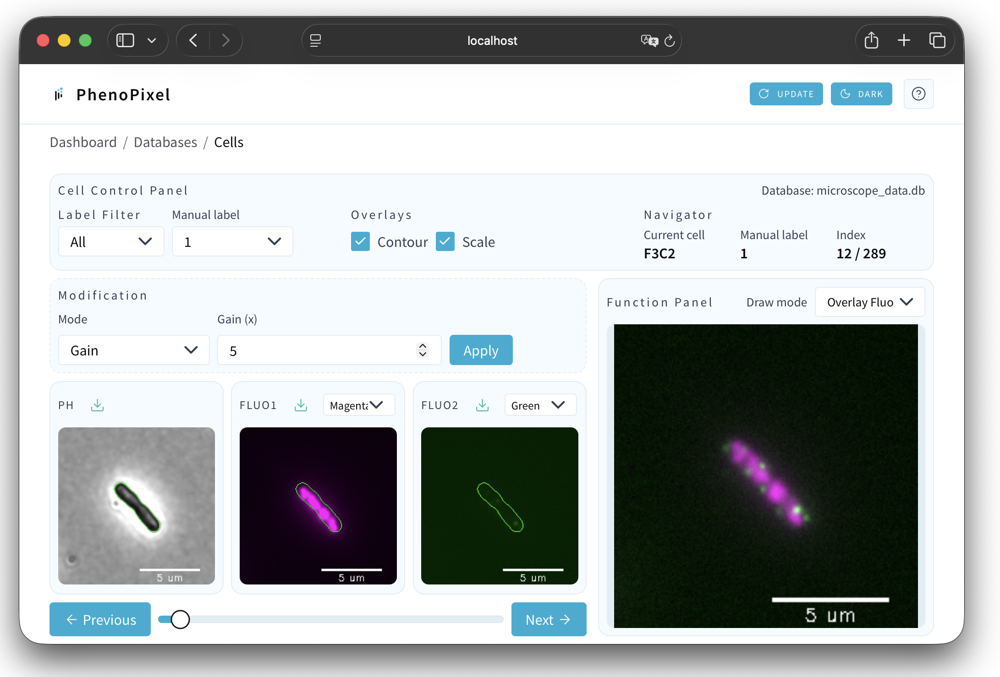

The cell viewer function panel provides these modes:

| Mode | Description |
| --- | --- |
| `Contour` | Show extracted contour coordinates. |
| `Replot` | Replot a cell in its aligned coordinate system. |
| `Overlay` | Overlay the contour on the default cell image. |
| `Overlay Raw` | Overlay fluorescence without contour masking on the raw view. |
| `Overlay Fluo` | Compose fluorescence channels with selectable colors. |
| `Heatmap` | Visualize centerline-projected fluorescence intensity. |
| `Map 256` | Render a 256-level mapped fluorescence view. |
| `Map Raw` | Render the mapped view at native pixel scale. |
| `Distribution` | Plot the intensity distribution for the selected cell/channel. |

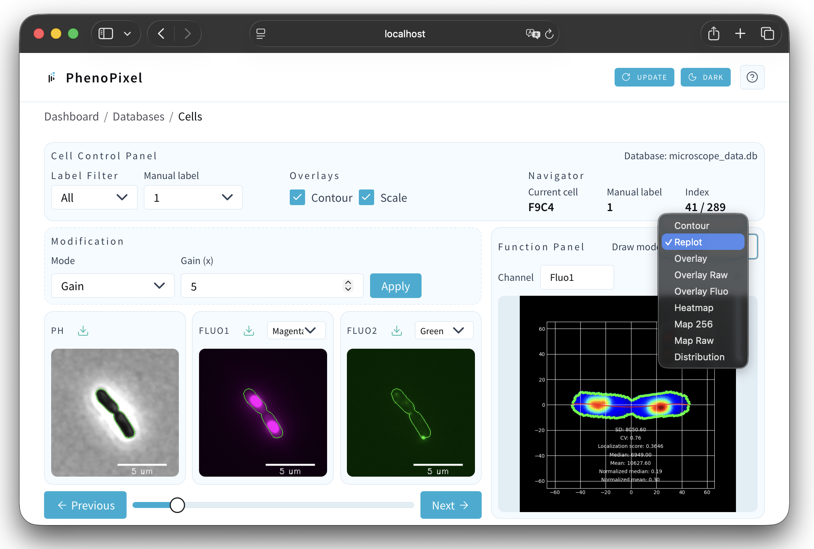

### 4. Annotation

Auto-detected contours may include debris or merged cells. Use Annotation to
move cells between `N/A` and analysis labels such as `Label 1`. Click cells
individually or use Shift-drag to select multiple cells before applying a label.

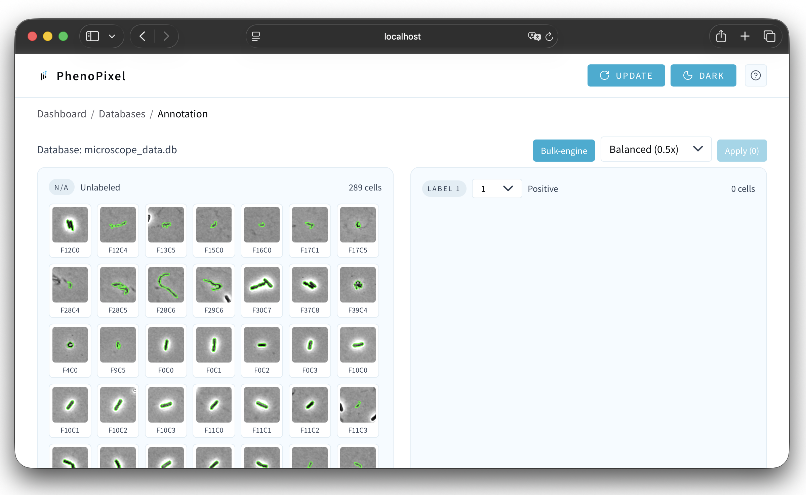

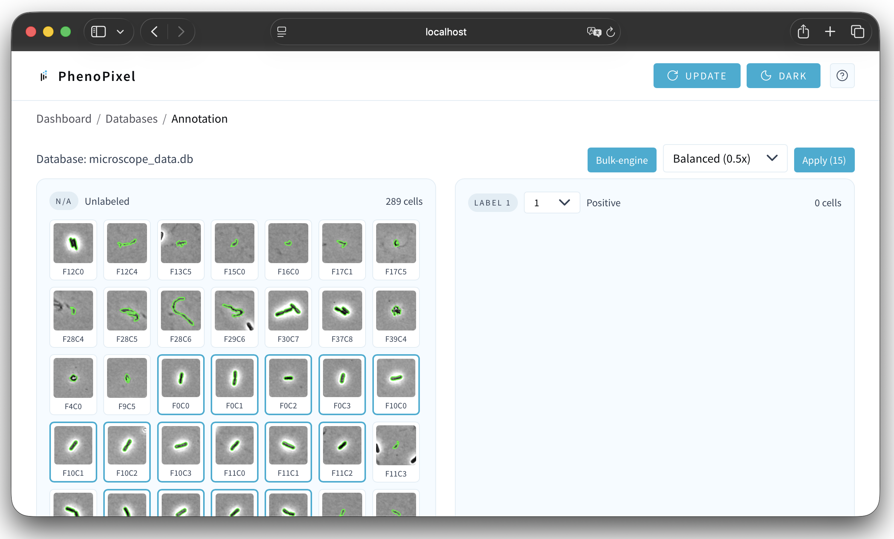

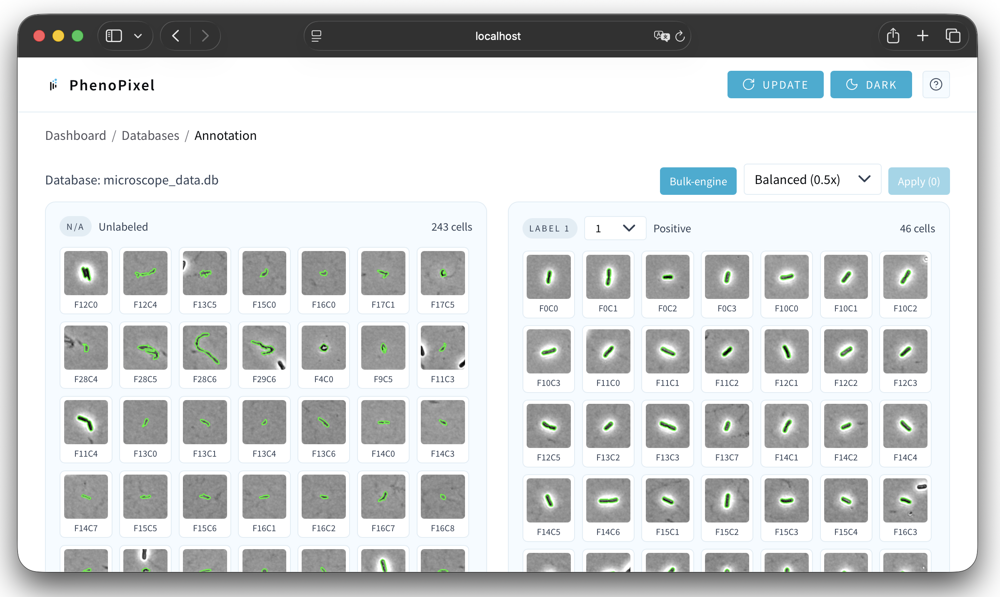

### 5. Bulk Engine

After annotation, use Bulk Engine to run population-level analysis on a selected
label. Return to Annotation if non-single cells remain in the selected group.

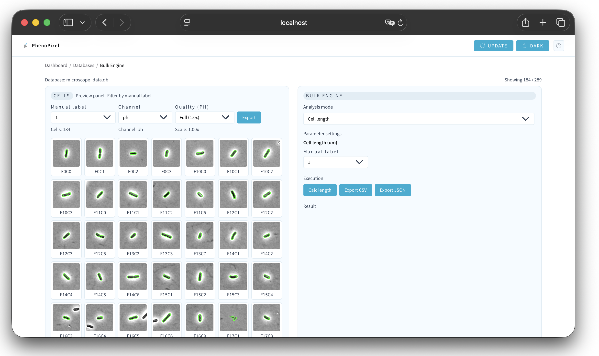

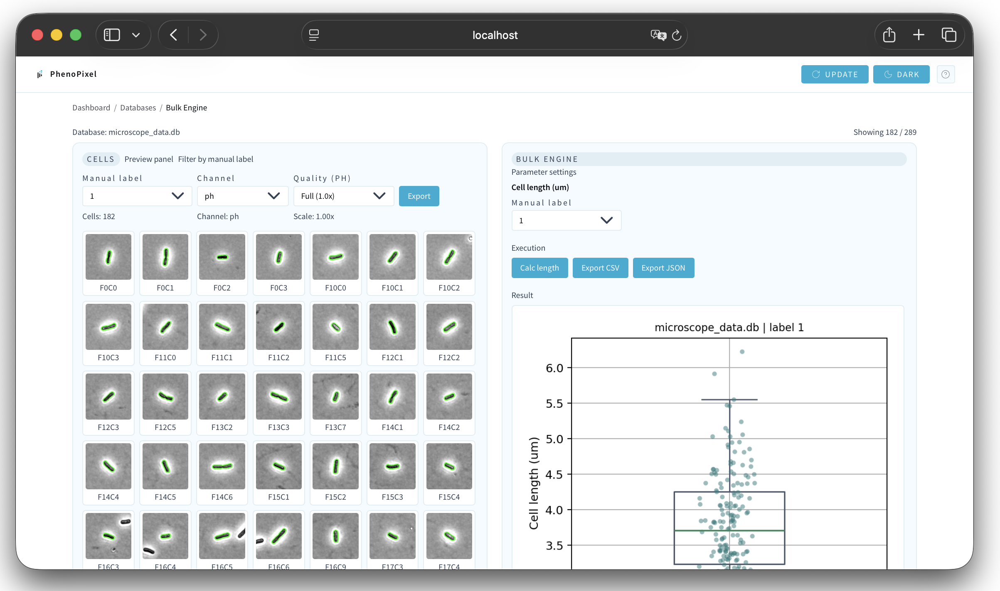

Bulk Engine modes:

| Mode | Description |
| --- | --- |
| `Cell length` | Measure cell length in micrometers from contour geometry and stored pixel size. |
| `Cell area` | Export cell area in pixels squared. |
| `Normalized median` | Compute cellwise median intensity after max normalization. |
| `FITC aggregation ratio` | Report the fraction of cells below the configured normalized-median threshold. |
| `Entropy` | Quantify fluorescence distribution with entropy / sparsity-style metrics. |
| `Heatmap` | Generate centerline heatmap vectors and absolute/relative heatmap plots. |
| `Contours` | Visualize aligned contours and export transformed contour coordinates. |
| `Map256` | Render population-level Map256 strips or contour maps. |
| `Raw data` | Export raw pixel intensities inside each contour. |

JSON and CSV exports are available for downstream analysis.

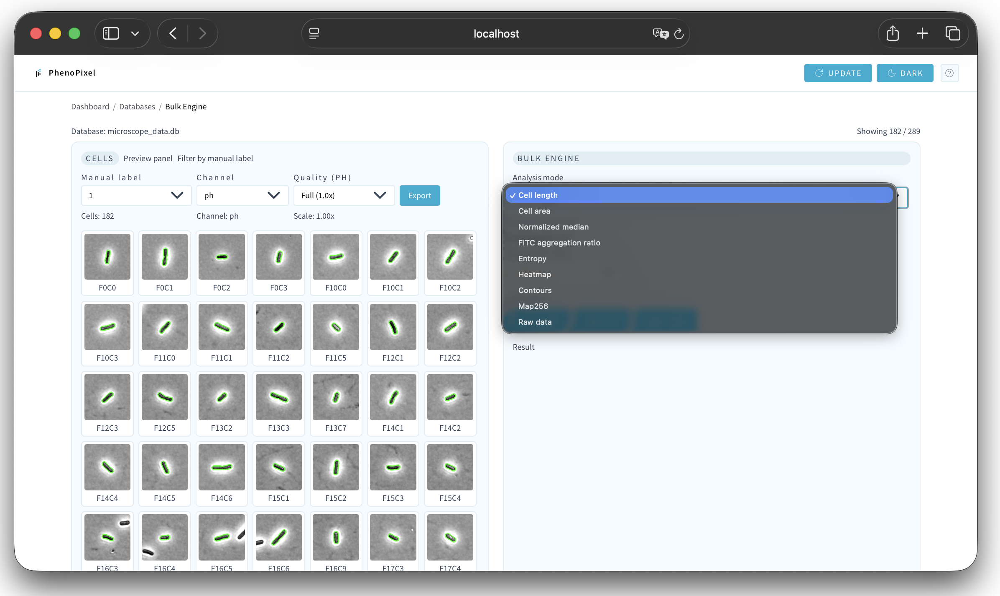

For example, `Heatmap` aggregates and visualizes fluorescence localization for
all cells in the selected label.

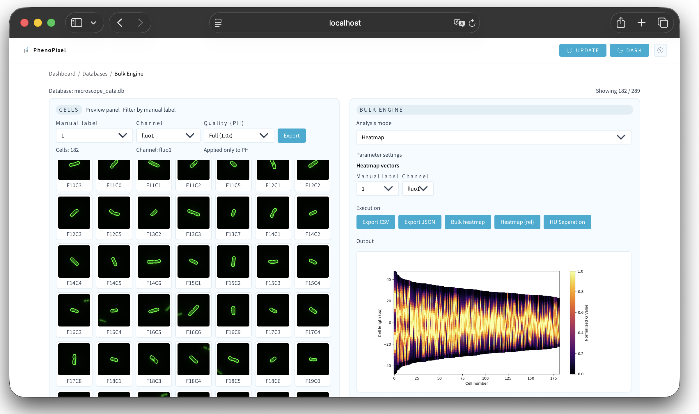

`Contours` mode focuses on contour geometry only. It exports aligned contour
coordinates as JSON or CSV, making it easier to prototype and validate
algorithms that use cell outline information without carrying fluorescence
images or raw intensity data through the analysis pipeline.

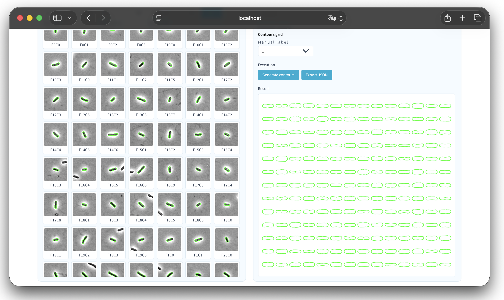

## Output Data

| Output | Location / format |
| --- | --- |
| Uploaded ND2 files | `backend/app/nd2files/` |
| Cell databases | `backend/app/databases/<nd2_stem>.db` |
| Extracted contour previews | `backend/app/extracted_data/<nd2_stem>/<frame>.png` |
| Cell table | SQLite table `cells`, including `cell_id`, `manual_label`, `perimeter`, `area`, `img_ph`, `img_fluo1`, `img_fluo2`, `contour`, center coordinates, objective, and pixel size. |
| Bulk exports | JSON/CSV/PNG responses from Bulk Engine endpoints or browser downloads. |
| Frontend production build | `frontend/dist/`; the backend serves this folder when it exists. |

## Default Parameters

| Parameter | Default / current behavior |
| --- | --- |
| Extraction threshold `param1` | `130` |
| Cell crop size | `200` px |
| Default layer mode | `dual` in the UI |
| Auto Annotation | On by default in the UI |
| Auto Annotation width screen | second PCA variance `lambda_2 <= 120` |
| Auto Annotation convexity screen | `hull_perimeter / perimeter > 0.85` |
| Extraction concurrency | `CELLEXTRACTION_MAX_CONCURRENCY`, default `2` |
| Objective presets | `100x = 0.065 um/px`, `60x = 0.108 um/px` |
| Heatmap vector bins | `35` |
| Centerline polynomial degree | `4` unless a request overrides it |
| FITC aggregation cutoff | `0.7414` |

## Analysis Methods

PhenoPixel's quantitative routines follow a shared single-cell pipeline:
detect contours from phase-contrast images, transform each cell into its
intrinsic coordinate system, then compute shape and fluorescence descriptors
that are comparable across cells.

<details>
<summary>Auto Annotation contour screen</summary>

Auto Annotation is a contour-only heuristic. After a contour
$C = \{(x_i, y_i)\}_{i=1}^N$ is extracted, the backend computes two geometric
scores and assigns `Label 1` only when both pass.

First, it measures contour thickness orthogonal to the major axis. Let

$$
\Sigma_C =
\frac{1}{N-1}
\sum_{i=1}^{N}
(\mathbf{p}_i - \bar{\mathbf{p}})
(\mathbf{p}_i - \bar{\mathbf{p}})^{\mathsf{T}},
\qquad
\mathbf{p}_i = (x_i, y_i)^{\mathsf{T}}.
$$

If the eigenvalues are $\lambda_1 \ge \lambda_2$, the contour is accepted only
when

$$
\lambda_2 \le 120.
$$

Second, it measures convexity from perimeter ratios. If $P(C)$ is the contour
perimeter and $P(\mathrm{Hull}(C))$ is the convex hull perimeter,

$$
\kappa(C) = \frac{P(\mathrm{Hull}(C))}{P(C)}.
$$

The contour is accepted only when

$$
\kappa(C) > 0.85.
$$

The final score is

$$
s(C) = \mathbf{1}[\lambda_2 \le 120] \, \mathbf{1}[\kappa(C) > 0.85].
$$

Auto Annotation assigns `Label 1` when $s(C) = 1$ and `N/A` otherwise.

</details>

<details>
<summary>Contour extraction, basis transform, and cell length</summary>

Let $C = \{(x_i, y_i)\}_{i=1}^n$ be the contour points of one cell and
$\Omega_C$ be the pixels inside that contour. The major elongation axis is
estimated from the covariance of contour coordinates,

$$
\Sigma =
\begin{pmatrix}
\mathrm{Var}[X_1] & \mathrm{Cov}[X_1, X_2] \\
\mathrm{Cov}[X_1, X_2] & \mathrm{Var}[X_2]
\end{pmatrix},
$$

and the principal direction is

$$
\mathbf{w}^* = \underset{\|\mathbf{w}\| = 1}{\mathrm{arg\,max}} \mathbf{w}^{\mathsf{T}} \Sigma \mathbf{w},
\qquad
\Sigma \mathbf{w} = \lambda \mathbf{w}.
$$

If $Q = (\mathbf{v}_1\ \mathbf{v}_2)$ is the orthonormal eigenvector basis,
coordinates are transformed by

$$
\mathbf{u} = Q^{\mathsf{T}} \mathbf{x},
\qquad
\mathbf{x} = Q \mathbf{u}.
$$

Because $Q$ is orthonormal, distances are preserved:

$$
\|\mathbf{u}\|^2
= \mathbf{u}^{\mathsf{T}}\mathbf{u}
= (Q^{\mathsf{T}}\mathbf{x})^{\mathsf{T}} (Q^{\mathsf{T}}\mathbf{x})
= \mathbf{x}^{\mathsf{T}} Q Q^{\mathsf{T}} \mathbf{x}
= \mathbf{x}^{\mathsf{T}} \mathbf{x}
= \|\mathbf{x}\|^2.
$$

In the aligned frame, the centerline is approximated by a polynomial,

$$
\hat{f}(u_1) = \theta^{\mathsf{T}} \phi(u_1),
\qquad
\theta = (W^{\mathsf{T}} W)^{-1} W^{\mathsf{T}} f.
$$

For curved cells, the thesis formulation defines cell length as the arc length
between the two contour-centerline intersections:

$$
L = \int_{u_{1,a}}^{u_{1,b}}
\sqrt{1 + (\frac{d\hat{f}}{du_1})^2}\,du_1.
$$

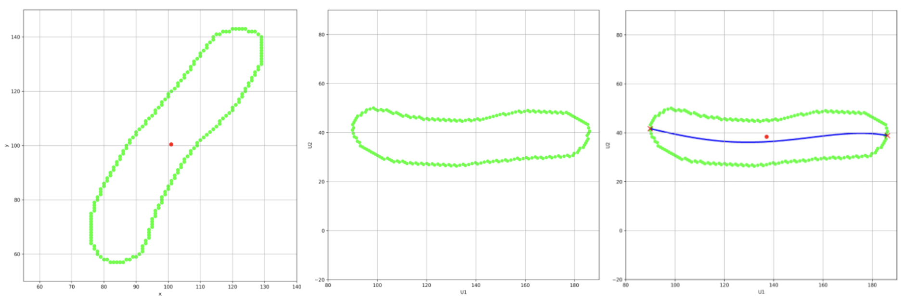

The current backend `Cell length` value uses a robust PCA major-axis extent and
the stored pixel size:

$$
L_{\mathrm{API}} \approx (\max_i \pi_i - \min_i \pi_i) \times \mathrm{pixel\_size\_um}.
$$

</details>

<details>
<summary>Area, raw pixels, fluorescence vectors, and phenotype scores</summary>

Cell area is stored as the area enclosed by the contour,

$$
A(C) = \iint_{\Omega_C} 1\,dA.
$$

`Raw data` exports the unaggregated intensity set

$$
\{ I(p) \mid p \in \Omega_C \}
$$

for the selected channel.

For each intracellular pixel $(p_i, q_i)$ with intensity $G(p_i, q_i)$, the
nearest point on the fitted centerline is found by

$$
u_{1,i}^* = \underset{u_1 \in [u_{1,a}, u_{1,b}]}{\mathrm{arg\,min}}
[(u_1 - p_i)^2 + (\hat{f}(u_1) - q_i)^2].
$$

This position is converted to arc length,

$$
\ell(u_1) = \int_{u_{1,a}}^{u_1} \sqrt{1 + (\hat{f}'(t))^2}\,dt,
\qquad
\ell_i^* = \ell(u_{1,i}^*).
$$

The arc-length interval is divided into $n$ bins and max-pooled:

$$
g_j = \max \{ G(p_i, q_i) \mid \ell_i^* \in I_j \}.
$$

If no projected pixel falls into $I_j$, $g_j = 0$. The fixed-length vector is

$$
\mathbf{g} = (g_1, \dots, g_n)^{\mathsf{T}}.
$$

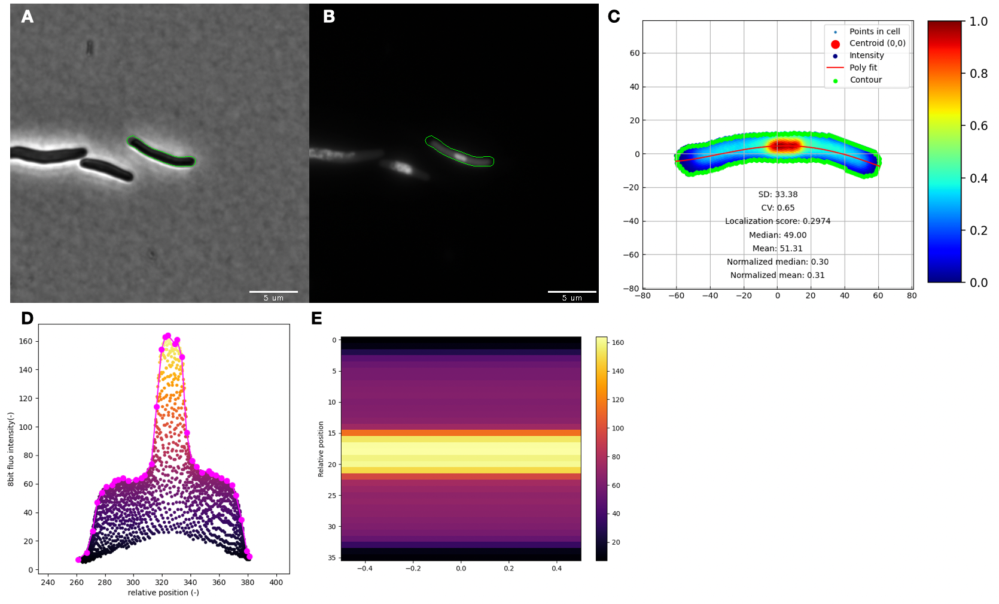

For any selected channel, intensities inside a cell are normalized by the
cellwise maximum,

$$
\tilde{I}_i = \frac{I_i}{\max_{p \in \Omega_C} I(p)},
\qquad
m(C) = \mathrm{median}(\tilde{I}_i).
$$

A population-level aggregation score can be written as

$$
R(\tau) = \frac{1}{N} \sum_{c=1}^{N} \mathbf{1}[m(C_c) < \tau].
$$

For HU-GFP compaction, a 35-bin peak vector is summarized as

$$
s(C) = \sum_{j=1}^{35} g_j.
$$

The abnormality threshold can be defined by the control 5th percentile,

$$
\tau_{\mathrm{HU}} = Q_{0.05}(\{ s(C_c^{\mathrm{ctrl}}) \}),
$$

and the HU aggregation ratio is the fraction of cells with $s(C) < \tau_{\mathrm{HU}}$.

For PI permeability,

$$
\mu(C) = \frac{1}{|\Omega_C|} \sum_{p \in \Omega_C} I_{\mathrm{PI}}(p),
$$

with a control-derived positivity threshold,

$$
\tau_{\mathrm{PI}} = Q_{0.95}(\{ \mu(C_c^{\mathrm{ctrl}}) \}).
$$

</details>

## Research Use / Citation

This repository is maintained to support reproducible reporting in research
papers. If you cite this software in a manuscript, include:

- **Software name**: PhenoPixel
- **Author**: Yunosuke Ikeda
- **Contact**: d263846@hiroshima-u.ac.jp
- **Repository URL**: this repository URL
- **Version evidence**: Git commit hash used in the analysis
- **Access date**: date you accessed the repository

Recommended citation:

```text
Ikeda, Y. PhenoPixel: microscopy single-cell extraction and batch phenotype analysis software.
GitHub repository. URL: <repository-url> (accessed <YYYY-MM-DD>), commit <commit-hash>.
```

For reproducibility, report OS/Python/Node versions, dependency snapshots, ND2
metadata or acquisition conditions, extraction parameters, labeling criteria,
Bulk Engine modes, thresholds, export settings, and the exact commit hash.

## Development And Quality Checks

Backend checks:

```sh
source ./venv/bin/activate
PYTHONPATH=backend python -m unittest discover backend/tests
```

Frontend checks:

```sh
cd frontend
npm run build
npm run lint
```

Screenshot/storybook assets:

```sh
./docs/make_screenshots.sh
```

## Production Build

Build the frontend before serving the app from the backend:

```sh
cd frontend
npm install --legacy-peer-deps
npm run build
cd ../backend
source ../venv/bin/activate
python main.py
```

When `frontend/dist/index.html` exists, `backend/main.py` serves the SPA and
static assets alongside the `/api/v1` API.

## Docker Deploy (Traefik)

`docker/compose.yaml` starts Traefik and the backend container. The current
compose file exposes the backend under `/api/v1/` and mounts persistent backend
data directories.

Create `backend/.env` first:

```sh
cp backend/.env.template backend/.env
```

Environment variables used by local/Docker deployment:

| Variable | Used by | Meaning |
| --- | --- | --- |
| `SLACK_WEHBOOK_URL` | Backend | Optional Slack webhook URL for job notifications. The variable name intentionally matches the current code/template spelling. |
| `BASE_PATH` | Backend | Optional frontend base URL used in Slack notification links. |
| `CELLEXTRACTION_MAX_CONCURRENCY` | Backend | Optional extraction job concurrency limit; defaults to `2`. |
| `SERVER_HOST` | Docker compose / Traefik | Hostname routed to the backend; compose defaults to `localhost` when unset. |
| `TRAEFIK_ACME_EMAIL` | Docker compose / Traefik | Email address for Let's Encrypt certificate registration. |

Start the stack:

```sh
cd docker
docker compose -f compose.yaml up -d --build
```

Traefik uses ports `80` and `443`. Access the hostname set in `SERVER_HOST`;
the API is exposed under `/api/v1`.

## Troubleshooting

| Symptom | What to try |
| --- | --- |
| Port already in use | Backend defaults to `3000`, frontend to `3001`, docs dev server to `3002`; stop the existing process or change the port. |
| `eslint: command not found` | Install frontend dependencies with `npm install` or `npm install --legacy-peer-deps`. |
| npm peer dependency conflict | Use `npm install --legacy-peer-deps`, matching `docs/make_screenshots.sh`. |
| ND2 upload is rejected | Confirm the file extension is `.nd2` and the filename does not rely on path components. |
| No contours or poor contours | Check layer mode, `param1`, crop size, and preview frames before annotating. |
| OpenCV import/runtime errors | Use the project venv and install `backend/requirements.txt`; Docker also installs `libgl1` and `libglib2.0-0`. |
| SQLite permission errors | Ensure `backend/app/databases/`, `backend/app/extracted_data/`, `backend/app/nd2files/`, and `backend/app/tempdata/` are writable. |

## Tech Stack

Backend:

<p align="left">
  <a href="https://fastapi.tiangolo.com/" title="FastAPI">
    
  </a>
  <a href="https://www.sqlalchemy.org/" title="SQLAlchemy">
    
  </a>
  <a href="https://numpy.org/" title="NumPy">
    
  </a>
  <a href="https://opencv.org/" title="OpenCV">
    
  </a>
  <a href="https://matplotlib.org/" title="Matplotlib">
    
  </a>
</p>

- FastAPI, Uvicorn, and Pydantic for the API layer
- SQLAlchemy and SQLite for database access
- NumPy, OpenCV, Pillow, and Matplotlib for image processing and plotting
- FastMCP for repository/context tooling

Frontend:

<p align="left">
  <a href="https://react.dev/" title="React">
    
  </a>
  <a href="https://vitejs.dev/" title="Vite">
    
  </a>
  <a href="https://www.typescriptlang.org/" title="TypeScript">
    
  </a>
  <a href="https://chakra-ui.com/" title="Chakra UI">
    
  </a>
</p>

- React + React Router for the UI
- Vite for dev/build tooling
- Chakra UI and Framer Motion for styling and motion
- Docusaurus docs build under `frontend/docs-site`

## Docs

- [Cell Extraction API](backend/app/cellextraction/README.md)
- [Database Manager API](backend/app/database_manager/README.md)
- [Bulk Engine API](backend/app/bulk_engine/README.md)
- [Frontend](frontend/README.md)
- [Contributing](CONTRIBUTING.md)

## License

PhenoPixel is released under the MIT License. See [LICENSE](LICENSE) for
details. Third-party dependencies remain under their respective licenses.
